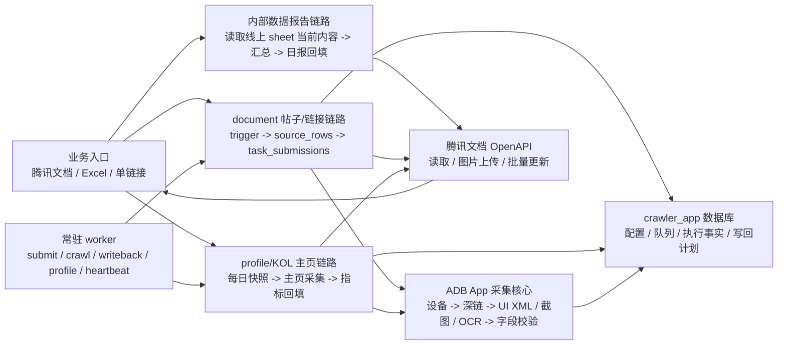

# 架构说明

本项目是 ADB App 采集系统。在线文档、Excel、单链接只是数据入口；真正的采集动作都通过 Android 设备、ADB、uiautomator2、截图、UI XML 和 OCR 完成。

最新架构图：



完整可维护源图见 [adb-crawler-architecture.mmd](assets/adb-crawler-architecture.mmd)。结构变更时优先同步 Mermaid 源图，再重新生成 PNG。

## 1. 项目边界

本项目只负责 Android App 侧采集：

- 支持 USB / Wi-Fi ADB 设备识别和健康检查。
- 支持支付宝、蚂蚁财富、腾讯财付通/理财通等 App 页面采集。
- 采集证据来自 App 页面、UI 节点、截图和 OCR。
- 不接入桌面微信、浏览器 DOM、Windows UI Automation 或 mock 采集。

## 2. 当前主链路

现在长期维护三条主链路：

| 链路 | 入口 | 目标 | 关键事实 |
| --- | --- | --- | --- |
| 帖子/链接型 document 链路 | 在线 sheet 中的 `post_url` | 回填发帖账号昵称、标题、评论、点赞、阅读、截图、备注等字段 | 以 `document_trigger_configs` 提交任务，队列化采集和字段级写回 |
| 大V主页 profile/KOL 链路 | 在线 sheet 中的 `homepage_url` | 回填粉丝数、增粉数、阅读数 | 以 `profile_trigger_configs` 和每日快照驱动，按 `日期 + 主页链接` 定位写回 |
| 内部数据报告 report 链路 | 线上日期 sheet 当前内容 | 统计预发帖、采集失败、成功、失败、阅读指标 | 以 sheet 当前数据为准，不再依赖数据库任务；默认统计昨日，周末跳过 |

## 3. 运行入口

统一入口是：

```powershell
.\scripts\run.ps1 -Task <task>
```

常驻 worker：

```powershell
.\scripts\run.ps1 -Task workers-start
.\scripts\run.ps1 -Task workers-status
.\scripts\run.ps1 -Task workers-stop
```

入口文件：

| 文件 | 职责 |
| --- | --- |
| `scripts/run.ps1` | PowerShell 统一运行入口 |
| `apps/finance_crawler/app.py` | CLI、scheduler、worker role 注册 |
| `apps/finance_crawler/config.py` | 默认配置、环境变量、运行目录 |
| `apps/finance_crawler/services/runtime_config.py` | 从 MySQL 加载运行配置 |

## 4. 分层结构

```text
apps/finance_crawler/
  app.py                         CLI / scheduler / supervisor
  config.py                      环境变量和默认配置
  crawler_app/
    documents/                   在线文档快照、表头识别、行解析、sheet 选择
    workflows/                   v2 文档触发、KOL 每日快照和主页采集
    tasks/                       任务类型、handler、submission 构建
    capture/                     App + task + fields 到采集动作的规划
    storage/                     crawler_app 数据库 schema 和 repository
    writeback/                   字段级写回定位和计划
  mobile/                        ADB、设备会话、截图、UI XML、OCR、页面动作
  crawlers/                      App 链接识别、包名、App 专属适配
  integrations/tencent_docs/     腾讯文档 OpenAPI 读写、图片上传、批量更新
  services/                      报告、运行配置、告警、写回公共服务
  storage/                       旧框架表、日志、兼容任务框架
  workflows/                     profile trigger、旧链路和兼容编排
```

分层原则：

- `crawler_app/documents` 负责把在线文档变成标准行和字段映射。
- `crawler_app/tasks` 负责把标准行变成可执行任务。
- `mobile` 负责 Android 设备通用能力，不写业务统计口径。
- `crawlers` 负责 App 差异，例如包名、深链、页面 ready 关键字和 App 专属解析。
- `services/report.py` 负责报告口径，当前只按线上 sheet 当前内容统计。

## 5. document 链路

适用场景：

- 每行有帖子链接或短链。
- 需要采集文章标题、截图、评论、点赞、阅读、发帖账号昵称等。
- sheet 列可能移动，但表头字段名称相对稳定。

核心流程：

```text
document_trigger_configs
  -> document_trigger_bindings
  -> submit_due_document_triggers
  -> TencentDocsSource
  -> resolve_header / extract_source_rows
  -> source_rows
  -> task_submissions
  -> crawl_pending_tasks
  -> task_executions
  -> writeback_plans
  -> Tencent Docs batch update
```

关键表：

| 表 | 作用 |
| --- | --- |
| `document_trigger_configs` | 配置一个在线文档、sheet 选择规则、扫描频率、目标日期偏移 |
| `document_trigger_bindings` | 一个触发器绑定哪些任务类型和字段，例如 `initial_check`、`detail`、`read_count` |
| `submit_runs` | 每次提交扫描的审计记录 |
| `documents` / `document_sheets` | 在线文档和 sheet 元信息 |
| `column_mappings` | 表头字段到列的映射 |
| `source_rows` | 标准化后的业务行 |
| `task_submissions` | 可重试的任务队列 |
| `task_executions` | 每次 ADB 执行尝试 |
| `writeback_plans` | 字段级待写回计划 |
| `capture_action_profiles` | App + 任务 + 字段组合对应的采集动作 |

重要规则：

- 提交任务时按单个 sheet 内 URL 去重，只取第一行。
- 写回时通过字段映射和 URL 重新定位，不只相信旧 `row_index`。
- `remark` 用来暴露当前运行结果，成功、缺失、终态失败都应有可读原因。

## 6. profile/KOL 链路

适用场景：

- 每行是大V主页链接 `homepage_url`。
- 需要采集粉丝数、增粉数、今日帖子阅读数。
- 读取和写回都必须按日期定位，同一主页每天一行。

核心流程：

```text
22:00 生成明日行
  -> KOL_DAILY_SNAPSHOT_DOC_URL
  -> kol_base_profiles
  -> kol_daily_snapshots
  -> 写入 KOL 结果 sheet

08:00 采集今日行
  -> profile_trigger_configs.kol_daily_metrics_wpvy0d
  -> profile_trigger_runs
  -> profile_metric_sources
  -> ADB 打开 homepage_url
  -> profile_metric_runs
  -> profile_metric_writebacks
  -> 按 日期 + homepage_url 写回
```

默认配置：

```text
config_key: kol_daily_metrics_wpvy0d
row_adapter: kol_daily_profile
source_name: kol_daily_crawl
task_type: profile_daily_metrics
fields: fans_count,growth_count,read_count
schedule_time: KOL_DAILY_CRAWL_TIME
```

写回保护：

- 写回前重新读取目标 sheet。
- 只在 `日期 + 主页链接` 唯一匹配时写回。
- 前一日没有粉丝数时，增粉数按 0 处理。
- 同一天最多取 3 条帖子参与阅读数识别和聚合。

## 7. report 链路

内部数据报告当前不再按数据库任务统计，而是按线上 sheet 当前内容统计。

流程：

```text
generate_report(target_date)
  -> 默认 target_date = 昨日
  -> 周末直接跳过
  -> select_sheets(mode=date_sheet)
  -> resolve_header / extract_source_rows
  -> 按产品汇总预发帖、程序采集失败、发帖成功、发帖失败、阅读指标
  -> 保存本地 report 文件
  -> 写入腾讯文档日报 sheet
```

相关文件：

| 文件 | 职责 |
| --- | --- |
| `apps/finance_crawler/services/report.py` | 报告日期、统计口径、周末跳过、腾讯文档写回 |
| `apps/finance_crawler/crawler_app/documents/sheet_selector.py` | 按日期选择 sheet |
| `apps/finance_crawler/crawler_app/documents/column_resolver.py` | 表头识别 |
| `apps/finance_crawler/crawler_app/documents/rows.py` | 业务行抽取 |

## 8. ADB 采集核心

```text
task handler
  -> prepare_adb_device
  -> DeviceSession.open_url
  -> App deep link / browser landing fallback
  -> UI XML + screenshot + OCR
  -> field extractor
  -> evidence validator
  -> task result
```

设备层职责：

- `utils/device_health.py` 选择和校验当前设备。
- `mobile/device_session.py` 打开 App 链接、处理深链跳转、重启 App、处理浏览器中“打开支付宝”等落地页。
- `mobile/capture_engine.py` 截图、dump UI XML、OCR、滚动。
- `mobile/action_plan.py` 定义字段采集动作组合。

App 差异放在 `crawlers/` 和 v2 capture planner 中，常见类型是：

| App 类型 | 说明 |
| --- | --- |
| `alipay` | 支付宝帖子、主页、短链深链 |
| `antfortune` | 蚂蚁财富分享链接和详情页面 |
| `tenpay` | 财付通/理财通页面和 OCR 专属解析 |
| `unknown` | 无法识别时的保守兜底 |

## 9. worker 调度

worker 通过 `SCHEDULER_ROLES` 分角色运行，常见角色如下：

| 角色 | 任务 | 频率配置 |
| --- | --- | --- |
| `submit` / `v2_submit` | 扫描到期 `document_trigger_configs` 并提交任务 | `SUBMIT_WORKER_INTERVAL_SECONDS` |
| `crawl` / `v2_crawl` | 消费 `task_submissions`，执行 ADB 采集 | `V2_CRAWL_WORKER_INTERVAL_SECONDS` |
| `writeback` / `v2_writeback` | 应用 `writeback_plans` 到在线文档 | `V2_WRITEBACK_WORKER_INTERVAL_SECONDS` |
| `profile` / `kol_snapshot` | 每晚生成 KOL 明日行 | `KOL_DAILY_SNAPSHOT_TIME` |
| `profile` / `kol_crawl` | 每天采集 KOL 今日主页指标 | `KOL_DAILY_CRAWL_TIME` |
| `heartbeat` | 写心跳日志 | `HEARTBEAT_INTERVAL_MINUTES` |

`ENABLE_LEGACY_SCHEDULER_JOBS=false` 时，旧版 fetch/check/detail/report 周期任务不会注册。

## 10. 数据库边界

当前运行数据库默认是 `crawler_app`。数据库用于排队、审计、执行记录、证据和写回计划；在线文档仍是业务表和最终适配层。

| 类别 | 代表表 |
| --- | --- |
| 触发器配置 | `document_trigger_configs`, `document_trigger_bindings`, `profile_trigger_configs` |
| 文档标准化 | `documents`, `document_sheets`, `column_mappings`, `source_rows` |
| 任务队列 | `task_submissions`, `task_executions`, `writeback_plans` |
| KOL 数据 | `kol_base_profiles`, `kol_daily_snapshots`, `profile_metric_sources`, `profile_metric_runs`, `profile_metric_writebacks` |
| 兼容和运行日志 | `crawl_task_submissions`, `crawl_task_executions`, `crawl_results`, `crawl_writebacks`, `task_log` |

## 11. 扩展原则

- 新增帖子/链接型业务：优先新增 `document_trigger` 和对应 `capture_action_profiles`。
- 新增主页型业务：优先新增 `profile_trigger`、row adapter 和主页 action profile。
- 新增 App：先补链接识别和 App profile，再补采集动作和字段解析。
- 新增写回字段：先定义固定业务字段名，再补表头识别、采集结果、写回定位。
- 高风险页面动作放在 handler/action profile/adapter 中，不放在 trigger 配置里。

## 12. 排查入口

| 问题 | 先看哪里 |
| --- | --- |
| 今天有没有提交任务 | `document_trigger_configs`, `submit_runs`, `task_submissions` |
| 任务为什么没跑 | `task_submissions.status`, `attempts`, `max_attempts`, `scheduled_at` |
| 手机是否可用 | `adb devices -l`, `utils/device_health.py`, worker 日志 |
| 采集失败原因 | `task_executions.error_type`, `result_summary_json`, 截图目录 |
| 写回是否成功 | `writeback_plans`, `profile_metric_writebacks`, 腾讯文档批量更新日志 |
| 日报为什么不一致 | 先看目标日期线上 sheet 当前数据，再看 `services/report.py` 的字段识别 |
