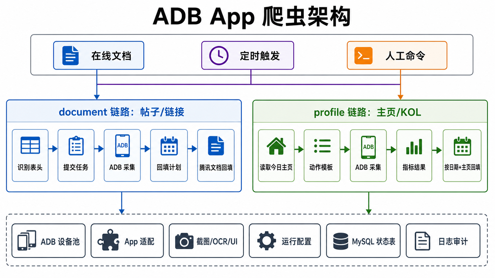

# 架构说明

本项目是 ADB App 爬虫。在线文档、Excel、单链接只是数据入口；真正的采集都通过 Android 设备、ADB、uiautomator2、截图、OCR 和 App 页面动作完成。



项目现在拆成两条长期主链路：

```text
document 链路：帖子/链接型任务
profile 链路：主页型任务
```

两条链路共用设备层、腾讯文档 OpenAPI、运行配置和日志，但任务表、触发器、动作模板和回填记录分开，避免把复杂主页动作塞进普通链接任务里。

## 项目边界

本项目只对接 ADB 手机：

- 支持 USB / Wi-Fi ADB 设备自动识别。
- 支持支付宝、蚂蚁财富、理财通等 App 页面采集。
- 不做桌面微信、浏览器、Windows UI Automation、mock 采集。

## 分层

| 层级 | 位置 | 职责 |
| --- | --- | --- |
| 入口层 | `apps/finance_crawler/app.py`, `scripts/run.ps1` | CLI、scheduler、supervisor、一次性任务 |
| 配置层 | `config.py`, `services/runtime_config.py` | 环境变量、MySQL 运行配置、腾讯文档 OpenAPI 配置 |
| 文档任务层 | `crawler_app/` | 帖子/链接型任务的提交、执行、回填、修正 |
| 主页任务层 | `workflows/profile_*`, `storage/profile_metrics.py` | 主页触发器、主页动作模板、粉丝数、阅读数、回填 |
| 设备层 | `mobile/`, `utils/device_health.py` | ADB 连接、设备选择、App 打开、截图、XML、OCR、重启恢复 |
| App 适配层 | `crawlers/`, `utils/link_source.py` | 链接识别、App 类型识别、App 差异策略 |
| 外部集成层 | `integrations/tencent_docs/` | 腾讯文档读取、批量写回、图片上传 |
| 存储层 | `storage/`, `crawler_app/storage/` | MySQL 表、任务状态、运行记录、回填记录 |

## 链路一：帖子/链接型 document 任务

适用场景：

- 在线文档里每行有帖子链接。
- 需要初检账号昵称、详情阅读数、评论数、截图、备注。
- 列位置可能漂移，但字段名基本固定。

核心流程：

```text
document_trigger_configs
  -> document_trigger_bindings
  -> submit_worker
  -> submit_runs
  -> task_submissions
  -> task_executions
  -> writeback_plans
  -> 腾讯文档回填
```

关键表：

| 表 | 作用 |
| --- | --- |
| `document_trigger_configs` | 配一个在线文档、选 sheet、扫描间隔、提交策略 |
| `document_trigger_bindings` | 一个触发器要提交哪些任务，例如 `initial_check`、`detail` |
| `submit_runs` | 每次提交扫描的审计记录 |
| `documents` / `document_sheets` | 在线文档和 sheet 元数据 |
| `column_mappings` | 通过表头解析出的字段到列映射 |
| `source_rows` | 标准化后的业务行 |
| `task_submissions` | 待采集任务队列 |
| `task_executions` | 每次 ADB 执行记录 |
| `writeback_plans` | 待写回计划 |
| `capture_action_profiles` | App + 任务 + 字段组合对应的采集动作组合 |

特点：

- 以 `post_url` 为采集对象。
- 字段通过 title 识别，不依赖固定列。
- 写回前会使用字段映射和行定位，避免简单按固定列硬写。
- 适合单链接、单详情页或短路径页面采集。

## 链路二：主页型 profile 任务

适用场景：

- 采集对象是主页链接 `homepage_url`。
- 粉丝数可能需要点击进入精确值页面。
- 阅读数需要在主页最近帖子中查找、点击详情页、聚合结果。
- 后续还可能有持仓入口、调仓明细等多步骤动作。

核心流程：

```text
profile_trigger_configs
  -> profile_trigger_runs
  -> profile_metric_sources
  -> profile_metric_runs
  -> profile_metric_writebacks
  -> 腾讯文档回填
```

关键表：

| 表 | 作用 |
| --- | --- |
| `profile_trigger_configs` | 配主页型触发器，例如每天 08:00 扫 `wpvy0d` 当天行 |
| `profile_action_profiles` | App + 主页任务 + 字段组合对应的动作模板 |
| `profile_trigger_runs` | 每次触发运行记录 |
| `profile_targets` | 主页目标，按主页链接生成稳定身份 |
| `profile_metric_sources` | 某一天某主页的采集来源行 |
| `profile_metric_runs` | 粉丝数、增粉数、阅读数等采集结果 |
| `profile_metric_writebacks` | 回填状态和错误记录 |

主页任务标准化对象：

| 对象 | 说明 |
| --- | --- |
| `row_adapter` | 如何从在线文档行解析主页任务，目前默认 `kol_daily_profile` |
| `action_profile` | 采集动作模板，例如 `alipay_profile_daily_metrics_v1` |
| `requested_fields` | 要采集和回填的字段，例如 `fans_count,growth_count,read_count` |
| `aggregation_policy` | 聚合策略，例如最近 3 条帖子阅读数取最大值 |
| `source_name` | 当前来源队列名，例如 `kol_daily_crawl` |

默认 KOL profile trigger：

```text
config_key: kol_daily_metrics_wpvy0d
doc: https://docs.qq.com/sheet/DYnhxS2VHZHBqR0V5?tab=wpvy0d
row_adapter: kol_daily_profile
source_name: kol_daily_crawl
task_type: profile_daily_metrics
fields: fans_count,growth_count,read_count
schedule_time: 08:00
action_profile_key: None
```

`action_profile_key = None` 表示按每行主页链接自动识别 App，再选择对应动作模板。

## KOL 每日链路

KOL 链路分两段：

```text
22:00 生成明日行
  -> KOL_DAILY_SNAPSHOT_DOC_URL
  -> kol_base_profiles
  -> kol_daily_snapshots
  -> 写入 wpvy0d

08:00 采集今日行
  -> profile_trigger_configs.kol_daily_metrics_wpvy0d
  -> 读取 wpvy0d 日期 = 今天的行
  -> profile_metric_sources
  -> ADB 采集粉丝数和阅读数
  -> profile_metric_runs
  -> 按 日期 + 主页链接 回填 wpvy0d
```

回填保护：

- 不只信旧 `row_index`。
- 写回前重新读取 `wpvy0d`。
- 只有 `日期 + 主页链接` 唯一匹配时才写。
- 同一天同主页出现多行时标记重复，不盲写。

## Scheduler

常驻入口：

```powershell
.\scripts\run.ps1 -Task supervisor
```

当前常驻任务：

| 任务 | 频率 | 说明 |
| --- | --- | --- |
| `v2_submit_worker` | `SUBMIT_WORKER_INTERVAL_SECONDS`，当前 300 秒 | 扫 document 触发器 |
| `v2_crawl_worker` | `V2_CRAWL_WORKER_INTERVAL_SECONDS`，当前 30 秒 | 扫 document 任务队列 |
| `v2_writeback_worker` | `V2_WRITEBACK_WORKER_INTERVAL_SECONDS`，当前 30 秒 | 扫 document 写回计划 |
| `kol_daily_snapshot` | `KOL_DAILY_SNAPSHOT_TIME`，当前 22:00 | 生成 KOL 明日行 |
| `kol_daily_crawl` | `KOL_DAILY_CRAWL_TIME`，当前 08:00 | 通过 profile trigger 跑今日主页任务 |
| `heartbeat` | `HEARTBEAT_INTERVAL_MINUTES` | 心跳日志 |

`ENABLE_LEGACY_SCHEDULER_JOBS=false` 时，旧版 fetch/check/detail/report 周期任务不会注册。

## 扩展原则

- 新增帖子/链接型业务：优先走 `document_trigger` + `capture_action_profiles`。
- 新增主页型业务：优先走 `profile_trigger` + `profile_action_profiles`。
- 新增 App：先让链接识别能返回稳定 `app_type`，再补对应 action profile。
- 新增回填字段：先定义字段名，再补行解析、采集结果、写回定位。
- 高风险页面动作不要塞进 trigger；trigger 只负责“何时扫、扫哪里、提交哪些字段”，复杂动作放在 action profile 和 handler 里。
